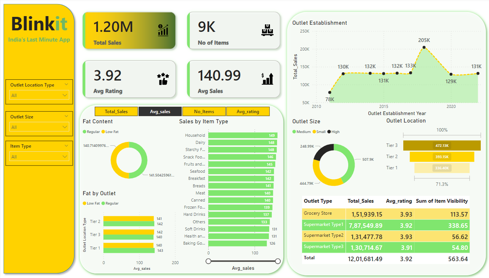

# Blinkit Sales & Outlet Performance Dashboard

## Overview
The Blinkit Sales & Outlet Performance Dashboard is a comprehensive Power BI dashboard designed to deliver actionable insights into sales performance, outlet demographics, customer preferences, and other critical metrics for Blinkit, a retail application. This dashboard empowers decision-makers with real-time data visualization and analysis, facilitating data-driven strategies to optimize revenue and improve customer satisfaction.

## Features
- **Interactive KPIs**: Key metrics like Total Sales, Average Sales per Item, and Average Rating are dynamically calculated using DAX functions, providing up-to-date insights.
- **Filter-Enabled Analysis**: Allows users to filter data by Outlet Location Type, Outlet Size, and Item Type, providing granular insights into sales performance across various dimensions.
- **Visual Analytics**: Data visualizations for outlet size distribution, outlet establishment trends, and item type sales breakdowns to identify performance trends and make data-backed decisions.
- **Segmentation & Custom Measures**: Computes segmented metrics for outlets and product categories, helping in targeting high-performing outlets and categories for strategic focus.

## Dashboard Insights
1. **Outlet Performance**: Breakdowns by outlet size, type, and location, highlighting top-performing outlets and providing insights into the distribution of sales.
2. **Sales Trends**: Displays sales trends over the years, enabling a historical analysis of growth and identifying seasonal or trend-based fluctuations.
3. **Customer Preferences**: Visuals and metrics on customer rating averages and item types, helping to tailor product offerings and marketing strategies.
4. **Fat Content Analysis**: A unique segmentation based on fat content, distinguishing between Regular and Low Fat items, assisting in product diversification strategies.

## Technology Stack
- **Power BI**: For data visualization and dashboard creation
- **DAX (Data Analysis Expressions)**: Used to calculate dynamic metrics and create custom measures for more insightful visualizations
  
## Usage
This dashboard is intended for business analysts, retail strategists, and executives looking to leverage data for improved decision-making in retail operations.

## Sample Visuals
  
*Example of the Blinkit Sales & Outlet Performance Dashboard in Power BI*

## How to Use the Dashboard
1. **Open Power BI**: Load the provided Power BI file.
2. **Apply Filters**: Use the filters for Outlet Location Type, Outlet Size, and Item Type to view specific data segments.
3. **Analyze KPIs**: Observe dynamic KPIs and adjust filters to drill down into specific outlets or item categories.
4. **Interpret Visuals**: Use the provided visualizations to derive insights into outlet performance, sales trends, and customer preferences.

## Insights and Impact
By implementing this dashboard, Blinkit gains:
- **Enhanced Sales Strategy**: Insights into top-performing outlets and item categories, helping drive targeted marketing and inventory strategies.
- **Improved Customer Satisfaction**: By analyzing average ratings and item preferences, Blinkit can tailor offerings to better meet customer demands.
- **Data-Driven Decision Making**: Enables data-backed strategic decisions across the business, optimizing revenue growth and operational efficiency.

## Future Enhancements
- **Predictive Analysis**: Incorporate forecasting features for sales trends.
- **Additional Segmentation**: Add new filters for deeper segmentation (e.g., by customer demographics).
- **Real-Time Data Integration**: Integrate live data for real-time updates in dashboard metrics.

## Contact
For any questions or suggestions, please feel free to reach out at mishhra.krishhna@gmail.com.

